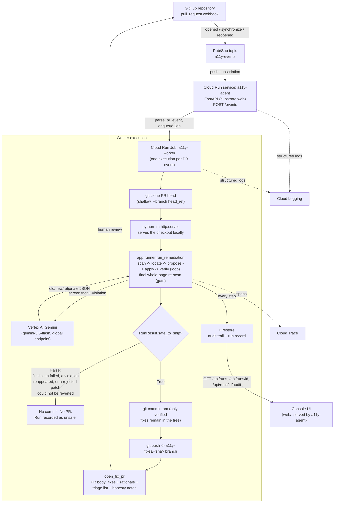

# Architecture

## Diagram

## Components

**GitHub repository.** The system of record for source and pull requests. It
never talks to this system directly except through its own webhook and
through the pull request this system opens back into it — the agent has no
standing write access beyond what a PR grants, and every change it makes is
reviewable before merge.

**Pub/Sub topic (`a11y-events`) and push subscription.** Decouples the
webhook receiver from the (slow, browser-driving) remediation work. A push
subscription delivers each event to the Cloud Run service's `/events`
endpoint; `substrate.web.create_app` acks with `204` even on a malformed or
unhandled payload, so a poison message cannot retry forever.

**Cloud Run service (`a11y-agent`, `app/main.py`).** A thin FastAPI app
(via `substrate.web`) that does two unrelated jobs on one deployment: parses
the webhook payload (`app/github_io.parse_pr_event`) and starts a Cloud Run
Job execution for a handled PR event (`substrate.events.enqueue_job`); and
serves the read-only console (`GET /`, `/api/runs`, `/api/runs/{id}`,
`/api/runs/{id}/audit`) over the same Firestore the worker writes to. It
never touches source code or GitHub credentials itself.

**Cloud Run Job (`a11y-worker`, `job/worker.py`).** One execution per PR
event. Clones the PR's head branch shallowly, serves it locally, and hands
it to `app.runner.run_remediation` — the scan/locate/propose/apply/verify
loop plus the final whole-page re-scan gate described below. Every step is
written to the Firestore audit trail as it happens, not only at the end.
Only when `RunResult.safe_to_ship` is `True` does it commit and push; only
then does it call `app.github_io.open_fix_pr`.

**`app/scanner.py`, `app/locator.py`, `app/patcher.py`, `app/applier.py`,
`app/verifier.py`, `app/runner.py`.** The remediation core, unchanged by
this batch. `scan_page` renders the target with Playwright and runs
axe-core 4.13.0 against it; `locator` finds the offending line in source;
`patcher` asks Gemini for a single-line, reversible replacement; `applier`
applies and can revert it; `verifier` re-scans after each patch; `runner`
orchestrates the loop and the final gate, and is the only place a patch is
promoted into `RunResult.verified`.

**Vertex AI Gemini (`gemini-3.5-flash`, `global` endpoint).** Proposes each
patch from the violation, the exact source line, and a full-page screenshot.
It never writes to disk or to GitHub directly — every patch it proposes
still has to survive `apply_patch`, `verify`, and the final gate before it
can ship.

**Firestore.** Two collections: `runs` (one document per PR event, the
row the console table lists) and `audit` (one document per run, an
ordered `entries` list — the reasoning chain the console's detail pane
renders). Written by the worker, read by the service.

**Console UI (`web/`).** A static, portal-grammar page served by the same
`a11y-agent` service. Lists runs, and on selecting one, renders both its
audit trail and the `RunResult` fields a human needs to trust it: whether
the run was safe to ship, whether the working tree was left modified, and
whether the audit trail itself is complete. It runs at zero WCAG 2.1 AA
violations against axe-core, verified with the same scanner this product
ships (`app.scanner.scan_page` against the running console, both in its
empty state and with a run's detail pane open).

**Cloud Trace / Cloud Logging.** `substrate.telemetry` emits one span per
scan/propose/apply/verify call (`a11y.scan`, `a11y.propose_patch`,
`a11y.verify`, `a11y.run`) and one structured JSON log line per event
(`run.complete`, `run.unsafe`, `pr.opened`, `pr.skipped`, …) — the trace is
the reasoning chain's timing, the logs are its record.

## The verification invariant

A patch reaches `RunResult.verified` — and only a patch in `RunResult.verified`
ever reaches a pull request — if and only if:

1. it resolved its own target violation on a re-scan taken *after* it was
   applied (`app/verifier.py::verify`), **and**
2. after every other violation in the run has also been through that loop,
   one final whole-page re-scan finds no violation identity in excess of
   what the run should have left behind (`app/runner.py::_grade`) — which is
   the only check that can catch a later patch quietly undoing an earlier
   one, since the per-patch check in (1) freezes its baseline at the start
   of the run and cannot see that.

Everything that is not verified is either reverted (a rejected patch) or
left for a human (`RunResult.triaged`) — never shipped silently. And a run
whose tree cannot be shown to be exactly the verified fixes —
`RunResult.tree_modified`, driven by a revert that failed or raised — ships
**nothing at all**: `job/worker.py::unsafe_reasons` refuses the commit, and
no pull request is opened. `RunResult.audit_complete` is tracked and
surfaced separately (in the PR body and the console) because a hole in the
*record* of a run is not the same fact as a hole in the *verification* the
run performed — the two are reported independently rather than one being
allowed to hide the other.
